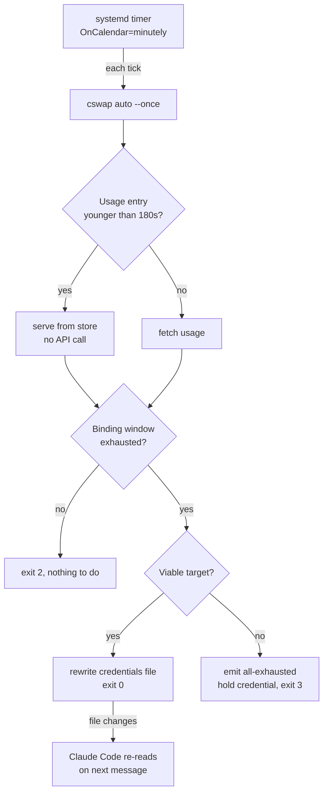

# cswap Auto-Switch on the Linux Host - Plan

## Goal Capsule

- **Objective:** Claude Code keeps working on the Linux host when the signed-in account runs out of quota, without
  someone noticing and logging in as another account.
- **Means:** A dotfiles-tracked systemd user timer runs `cswap auto --once` every minute (KTD1), configured to count
  per-model windows so the limit that actually binds is the one that fires (KTD3).
- **Authority:** Requirements govern behavior. KTDs govern mechanism. Where a KTD and the upstream tool's behavior
  disagree, the tool's behavior wins and the KTD is wrong.
- **Execution profile:** Packaging and host configuration. Prefer runtime smoke verification over unit coverage; the
  repo-side assertions are shape checks, not behavior proofs.
- **Stop conditions:** Stop and ask if deploying would rotate credentials on a host the user did not name, or if
  verification shows a switch happening while the outgoing account still has usable quota.
- **Tail ownership:** The second account is registered by the user, outside this plan. Deployment completes without it
  (R6).

---

## Product Contract

### Summary

Deploy `cswap auto --once` as a dotfiles-tracked systemd user timer on the Linux host so account rotation happens
unattended, and include per-model windows in the trigger so the limit that actually binds is the one that fires.

### Problem Frame

The Linux host carries the large majority of this fleet's Claude Code work, and it runs one account at a time. When that
account's quota is spent, work stops until a person notices and runs `/login`. `cswap` is installed on the host and can
rotate accounts on its own, but nothing invokes it: there is no unit, no timer, and no cron entry, and every
`autoswitch.*` setting is still at its shipped default.

The default configuration is insufficient because the account-wide windows are not the windows that bind. Read from the
accounts directly: one account reports a per-model weekly window at 100% while its 5-hour window reads 5% and its 7-day
reads 54%; the other reports the same model at 93% against a 16% 5-hour window. A trigger reading only the account-wide
windows sees two healthy accounts and never fires, while the model the work actually uses is spent.

### Key Decisions

- Trip point configured at 99% (session-settled: user-directed — chosen over both the 90% default and a 99.7 setting:
  the switch must land while the account can still serve, because an agent that hits the wall mid-turn stalls and needs
  a manual restart). Governs R2.
- Run only on the Linux host; no macOS equivalent (session-settled: user-directed — chosen over a cross-platform
  deployment: the Mac is interactive, where a person sees the limit and switches). Governs R7.
- Registering the second account is the user's, done on their own schedule; deployment must not wait for it
  (session-settled: user-directed — chosen over blocking the rollout until two accounts exist). Governs R6.

### Requirements

**Rotation behavior**

- R1. The rotation check runs every minute on the Linux host, unattended, and resumes after reboot.
- R2. A switch triggers while the active account can still serve, at 99% utilization of its binding window, rather than
  on exhaustion.
- R3. Per-model weekly windows count toward the trigger alongside the account-wide 5-hour and 7-day windows.
- R4. When no account can be switched to, the current credential is held and not rotated.
- R5. Rotation never moves onto a metered API-key account.

**Deployment**

- R6. Deployment completes and the timer runs while only one account is registered.
- R7. The units never deploy to macOS.
- R8. The units and their configuration are reproducible from the repo on a fresh host, including a `--all` rebuild.

### Success Criteria

- An unattended switch is observed end to end: rotation happens with no human action, the outgoing account still has
  quota left at the moment of the switch, and a running Claude Code session picks up the new credential on its next
  message without a restart.
- A failing rotation check is visible as a failed unit rather than as a silently wedged process.
- After a macOS deploy, no cswap unit is present in the user systemd directory.

### Scope Boundaries

- Registering the second account on the Linux host.
- Auto-switching on macOS, and any change to the Mac's cswap setup.
- The CodexBar adapter and its account display.
- Changing which accounts exist, their aliases, or their credentials.

#### Deferred to Follow-Up Work

- Alerting on the exhausted and quarantined states. Both are emitted and logged; routing them to a notification is
  separate work.
- Tracking `cswap`'s own version in the repo. It is a `uv tool` install, and this repo has no pattern for pinning those.

### Outstanding Questions

- Deferred: whether the same units should later run on the Mac. Out of scope here by R7; revisit only if the Mac starts
  running unattended sessions.

---

## Planning Contract

### Key Technical Decisions

- KTD1. **A timer plus a oneshot unit, not a long-running daemon.** (session-settled: user-directed — chosen over a
  service daemon: the tool governs its own fetch cadence, so a daemon buys no responsiveness the timer lacks.) The
  engine floors usage refetches at 60 seconds even in its tightest mode, so `OnCalendar=minutely` matches the fastest
  cadence the trigger can ever act on. Two properties then favour the timer. A failing tick inside the daemon's loop is
  caught and slept past, so a wedged watcher stays `active (running)` and green, while a failed `--once` tick surfaces
  in the failed-unit list. And `--once` holds live refresh tokens for a fraction of a second per minute rather than
  continuously. Follows `stow/rclone/dot-config/systemd/user/box-bisync.{service,timer}`, the repo's existing
  `OnCalendar=minutely` pair. Governs R1.

- KTD2. **Settings applied through the persisted config, not unit flags.** `cswap config set` writes settings that apply
  to every invocation, including a hand-run `cswap auto --once` during debugging. Flags in `ExecStart` would apply only
  to the timer's ticks and make a hand-run diverge silently from deployed behavior. Governs R2, R3, R5.

- KTD3. **Per-model windows count toward the trigger, set to `all` rather than a named model.** Without the setting the
  trigger reads only the account-wide windows, which the Problem Frame shows are not the binding ones. `all` is chosen
  over naming the model because an unmatched model name is a warning-only no-op: the trigger silently reverts to
  account-wide-only, and no repo-side or deploy-side check in this plan can tell that state from a correct one. Governs
  R3.

- KTD4. **The anti-flap margin is lowered to 2 points.** The margin gates the proactive path only, and a 99 trip point
  is what makes that path reachable: the engine reports whole-number percentages, so a reading of 99 still leaves
  headroom and selects the proactive trigger rather than the at-limit escape. At the shipped margin of 10 the target
  would have to sit at or below 89% to be accepted, and a peer anywhere between 89 and 99 would be refused until the
  active account reached exhaustion, which is the outcome the trip point exists to avoid. At 2 the accepted band widens
  to 97 and below. Flapping stays bounded: once both accounts are at or above the trip point the percentage margin no
  longer applies, and the engine's all-exhausted escape takes over with its own one-way guards. Governs R2.

- KTD5. **A stow package registered in `SHARED_PACKAGES` with a Linux-only guard.** This follows `codex-proxy`, the
  repo's other Linux-only systemd user unit: listed in `SHARED_PACKAGES` so a `--all` rebuild deploys it on Linux, and
  named in the non-Linux guard case in `scripts/stow-deploy` so a macOS deploy skips it with a warning. Leaving the
  package out of both lists would satisfy R7 but fail R8, because `--all` on a rebuilt host would not deploy it. Governs
  R7, R8.

- KTD6. **The units address the binary through the systemd `%h` specifier.** This follows the repo's dominant
  convention: eight committed user units already use `%h`, including the opendataloader, codex-proxy, obsidian, tmux,
  and qmd units. A minority hardcode an absolute home path, which works on one host and pins a username into a repo that
  deploys to many. Governs R8.

- KTD7. **cswap's settings file is applied by command, not stowed.** The tool rewrites that file when any setting
  changes, so a stow symlink would be replaced by a regular file on first write and the repo copy would stop tracking
  reality. This is the same failure already documented for the CodexBar config, which the repo handles with an apply
  script rather than a symlink. Governs R8.

### Assumptions

- The Linux host's `cswap` stays at a version whose `config set` keys and `auto` flags match those this plan targets. A
  major upgrade could rename either, and the settings script would then apply nothing while reporting success.
\g<0>

### High-Level Technical Design

The binding window is the highest utilization across the account-wide 5-hour and 7-day windows plus each per-model
weekly window. A tick evaluates every minute but fetches only when the tool's own freshness floor says the entry is
stale, so the timer adds no sustained API load. The credential handoff is file-based on Linux, which is why no restart
is needed.

### Sequencing

U1, U2, and U4 are repo changes and land together. U3 deploys them. U5 is staged verification: its first stage completes
at deploy time, its second is gated on the user registering the second account.

---

## Implementation Units

### U1. cswap stow package with the timer and oneshot unit

- **Goal:** A committed timer and oneshot unit pair that runs the rotation check every minute.
- **Requirements:** R1, R7, R8
- **Dependencies:** none
- **Files:**
  - `stow/cswap/dot-config/systemd/user/cswap-auto.service` (create)
  - `stow/cswap/dot-config/systemd/user/cswap-auto.timer` (create)
  - `scripts/stow-deploy` (modify)
- **Approach:**
  1. Model the pair on `stow/rclone/dot-config/systemd/user/box-bisync.{service,timer}`: `Type=oneshot` on the service,
     `OnCalendar=minutely` and `Persistent=true` on the timer, `WantedBy=timers.target` on the timer's install section.
  2. Address the binary through `%h`, per KTD6, and carry the `NoNewPrivileges` / `PrivateTmp` hardening pair the repo's
     other user units use.
  3. Do not set `Restart=` on a oneshot unit. A failed tick should surface as a failed unit, which is the observability
     KTD1 selects the timer for.
  4. Register `cswap` in `SHARED_PACKAGES` and in the non-Linux guard case in `scripts/stow-deploy`, alongside
     `codex-proxy`, per KTD5.
  5. Put no trip point or model flags in `ExecStart`; KTD2 puts them in the persisted config.
- **Patterns to follow:** `stow/rclone/dot-config/systemd/user/box-bisync.timer` for the minutely-and-persistent shape;
  `stow/opendataloader-pdf/dot-config/systemd/user/opendataloader-pdf.service` for a `%h`-addressed `ExecStart` and the
  hardening pair; `scripts/stow-deploy:293-300` for the Linux-only guard case.
- **Test scenarios:** deferred to U4, which owns the repo-side assertions for this unit.
- **Verification:** `systemd-analyze verify` accepts both units on the Linux host.

### U2. Settings deploy script

- **Goal:** The trip point, the per-model trigger, and the API-key exclusion are applied reproducibly on any host that
  runs the timer.
- **Requirements:** R2, R3, R5, R8
- **Dependencies:** none
- **Files:**
  - `scripts/cswap-autoswitch-deploy.sh` (create)
  - `scripts/lint-shell` (modify)
- **Approach:**
  1. Follow the guard-apply-report structure of `scripts/sshd-locale-deploy.sh`.
  2. Set four keys explicitly: the trip point to 99, the anti-flap margin to 2 per KTD4, the per-model trigger to `all`
     per KTD3, and the API-key-account exclusion to false per R5. The last is already the shipped default, but it is the
     one setting whose flip would start metered spend on an unattended host, so the script pins it rather than
     inheriting it.
  3. Leave the cooldown and poll interval untouched. The script sets only what this plan depends on, so a harmless
     upstream default change is inherited rather than pinned.
  4. Resolve the binary as an overridable variable, defaulting to `cswap` on `PATH`, and document that in the script
     header the way `scripts/stow-deploy` documents its target override. This is the test seam: `cswap config set`
     writes to a root the tool resolves internally, so there is no path flag to redirect, and without an override the
     repo suite would rewrite the developer Mac's live settings.
  5. Exit non-zero with a clear message when the binary is absent, rather than partially applying.
  6. Register the script in both `_is_target` and `_all_targets` in `scripts/lint-shell`, following the existing
     `scripts/sshd-locale-deploy.sh` entries. A `scripts/*.sh` path that is not enumerated there is skipped silently
     even when passed by name, so the Verification Contract's lint gate would otherwise never reach it.
- **Patterns to follow:** `scripts/sshd-locale-deploy.sh` for structure; `scripts/stow-deploy`'s target-override env var
  for the sandbox seam.
- **Test scenarios:** these live in `tests/cswap-autoswitch.bats` (U4) and run against a stub binary on a sandboxed
  path, never the installed one.
  - Running the script twice leaves the settings identical after the second run and reports no change.
  - With the binary absent, the script exits non-zero and names the missing dependency.
  - The script sets the per-model trigger to `all`, not a named model and not unset.
  - The script sets the trip point to 99 and the anti-flap margin to 2, so the proactive path is reachable and not
    blocked by the default margin.
  - The script sets the API-key-account exclusion explicitly rather than relying on the default.
- **Verification:** The recorded stub invocations show all three settings applied, and a second run is a no-op.

### U3. Deploy and enable on the Linux host

- **Goal:** The timer is active on the Linux host and survives a reboot.
- **Requirements:** R1, R6
- **Dependencies:** U1, U2
- **Files:** none in the repo; this unit is a host action.
- **Approach:**
  1. Record the account's current per-window utilizations before enabling anything, so the Problem Frame's
     binding-window claim is sourced to a reading on this host rather than carried from the Mac.
  2. Deploy the package, reload the user daemon, then enable and start the timer.
  3. Confirm lingering is enabled for the user. Without it the timer does not run until an interactive login, which
     would leave the deployment looking complete and inert after a reboot.
  4. Confirm the timer is active with one account registered, per R6. Ticks are expected to exit with the nothing-to-do
     status in that state.
- **Execution note:** This begins rotating credentials unattended once a second account exists. Confirm ticks are
  running and taking no action before the second account is added.
- **Test scenarios:** none in the repo. This unit is host state; its proof is U5.
- **Verification:** The timer reports active, a reboot leaves it active, and the journal shows ticks exiting with the
  nothing-to-do status while one account is registered.

### U4. Repo guards for the package's shape

- **Goal:** The deployment properties this plan depends on cannot regress silently.
- **Requirements:** R7, R8
- **Dependencies:** U1
- **Files:**
  - `tests/cswap-autoswitch.bats` (create)
- **Approach:**
  1. Assert against the committed units, the deploy script, and `scripts/stow-deploy`, not against host state, so the
     suite passes on both platforms.
  2. Cover the properties that are invisible at review time: the deploy-list registration, the Linux-only guard, and the
     absence of a username anywhere in the committed files.
  3. Host U2's settings scenarios here, against a stub binary on a sandboxed path.
- **Patterns to follow:** `tests/qmd-serve.bats` for the whole-file username assertion and its `/home/linuxbrew/`
  allowlist; `tests/trash-mechanism.bats` for asserting on repo file content; `tests/shell-config.bats` for the
  `bats_require_minimum_version` and `run !` conventions.
- **Test scenarios:**
  - The timer declares `OnCalendar=minutely` and `Persistent=true`.
  - The service is `Type=oneshot` and declares no `Restart=` directive.
  - Neither committed unit nor the deploy script contains a home-directory path other than the Linuxbrew prefix, so no
    committed file carries a username. Scope the assertion to the whole file, not to the `ExecStart` line: a `PATH` or
    `WorkingDirectory` directive is where a username would land next.
  - `cswap` appears in `SHARED_PACKAGES` in `scripts/stow-deploy`.
  - `cswap` appears in the non-Linux guard case in `scripts/stow-deploy`, so a macOS deploy skips it.
  - The deploy script is executable and is enumerated as a lint target in `scripts/lint-shell`.
  - U2's four settings scenarios, against the stub binary.
- **Verification:** The new file passes under `scripts/run-tests --all` on macOS, where no cswap unit is deployed and
  the developer's own cswap settings are untouched.

### U5. Staged verification of rotation

- **Goal:** Evidence that rotation works unattended, separated into what one account can prove now and what needs two.
- **Requirements:** R1, R2, R3, R4
- **Dependencies:** U3
- **Files:** none.
- **Approach:**
  1. **Single-account stage, available at deploy time.** With one account registered there are no candidates, so the
     tick reports the blocked outcome and rewrites no credential. Record that as R4's evidence rather than waiting for
     both accounts to be spent. Confirm ticks recur on the timer's cadence and that the journal shows no run of error
     events, since an active timer alone does not prove the check is working.
  2. **Two-account stage, after the user registers the second account.** Confirm a switch happens with no human action,
     that the credentials file is rewritten at that moment, and that a running Claude Code session continues on the new
     account without a restart.
  3. Capture which window bound the decision at the moment of the switch. A switch driven by the 5-hour window is
     indistinguishable in the journal from one driven by a per-model window, so without this reading the observed switch
     proves R2 but says nothing about R3.
  4. Record the trigger the switch reports. The proactive trigger is the expected value; an at-limit trigger means the
     switch landed on exhaustion instead of ahead of it, which is the failure R2 exists to prevent.
  5. Distinguish a quarantine from an exhaustion hold. A dead refresh token removes an account from rotation until the
     user logs in with it again, and that state presents the same way as a legitimate hold: no further credential
     rewrites. Confirm the two events are distinguishable in the journal.
- **Execution note:** The journal lines for switch and quarantine events render the account's email address inline.
  Redact it to an account ordinal before any journal excerpt is recorded outside the host, in a PR body, a commit
  message, or a docs entry.
- **Test scenarios:** none in the repo. This unit is runtime observation on a host.
- **Verification:** The single-account stage shows recurring ticks, a blocked outcome, and no credential rewrite. The
  two-account stage shows one credential rewrite per switch, an uninterrupted Claude Code session across it, and a
  recorded window reading identifying which limit bound the decision.

---

## Verification Contract

| Gate           | Command                                                                                                 | Applies to |
| -------------- | ------------------------------------------------------------------------------------------------------- | ---------- |
| Repo suite     | `scripts/run-tests --all`                                                                               | U1, U2, U4 |
| Shell lint     | `scripts/lint-shell --all`                                                                              | U2, U4     |
| Unit syntax    | `systemd-analyze verify` on both deployed units                                                         | U1, U3     |
| Timer state    | timer reports active after enable and after reboot                                                      | U3         |
| Tick health    | journal shows recurring ticks and no run of error events                                                | U3, U5     |
| Hold proof     | blocked outcome and no credential rewrite with one account registered                                   | U5         |
| Rotation proof | one credential rewrite per switch, session continues without restart, with the bounding window recorded | U5         |

The repo suite and shell lint run on macOS and must pass there with no cswap unit deployed and the developer's cswap
settings unchanged. The remaining gates are host gates and run on the Linux host only.

---

## Definition of Done

The completion bar for this plan is everything through the single-account stage:

- The units and deploy script are committed, and the repo suite and shell lint pass on macOS.
- `cswap` is registered in `SHARED_PACKAGES` and in the Linux-only guard, and no committed file carries a username.
- The timer is enabled and active on the Linux host, survives a reboot, and ticks without acting while one account is
  registered.
- The single-account stage of U5 is observed, including R4's blocked-outcome evidence.
- No experimental units, leftover scratch settings, or half-applied config remain on the host.

The two-account stage of U5 is tracked as a deferred verification item outside that bar, since R6 settles that
deployment must not wait on the second account. Record it when the user registers that account.
